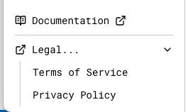

The dashboard is available at https://app.babba.ge/.

## Authentication
Learn how to [sign up](auth/sign-up), [sign in](auth/sign-in) and [sign out](auth/sign-out).

## User Dashboard

If you're a new *User*, you should [join a Project](user/projects) or two. And
optionally, manage your [personal Profile](user/profile) and [personal Metrics](user/metrics).

Then, head straight to [My Insights](user/insights) in the Dashboard!

## Administration
If you're an *Administrator*:
* help [your users](admin/users) join a Project or two, and
* manage the [Data Sources](admin/sources), [Metrics](admin/metrics) and [LLMs](admin/llms) associated with the Projects you administer.

# Company
Learn about the Babbage Insight Dashboard's [Tooling Infrastructure](tooling), and our
[Roadmap](upcoming)!

Links to this *Documentation*, our [Terms of Service](company/terms-of-service) and [Privacy Policy](company/privacy-policy)
are also available on the bottom left corner of the Dashboard:

