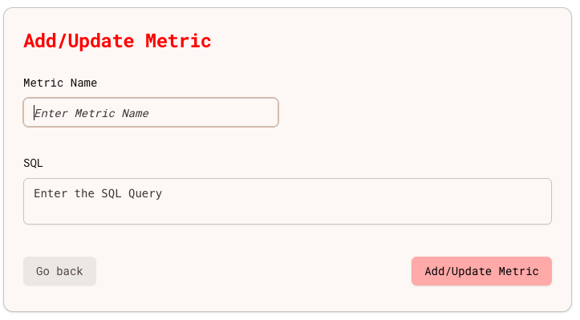
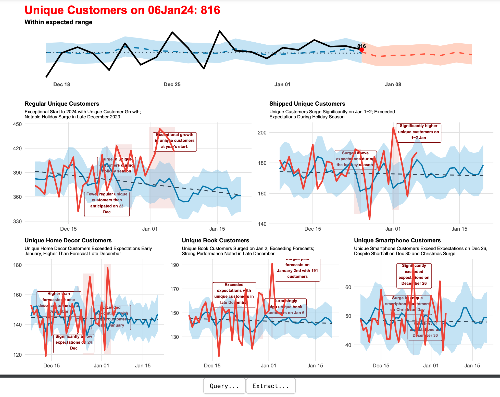

## What is Babbage Insight?
Babbage Insight is your **Virtual Chief Analytics Officer**. It continuously
monitors your data and provides you *exceptional insights* about your business.

## Join Us!
To start a trial, or get a demo, 
* [Contact the Babbage Insight team](mailto:team@babbageinsight.com) right now,
* [Sign Up](/auth/sign-up) for your own account today, and
* Learn all about how [**our Dashboard**](/dashboard) works!

## How does it work?
You simply tell us your *high-level* key business metrics, and the queries to
compute them.

"High level" means we only want the top-level metrics. For example, one metric
each for revenue, profit margins, customer acquisition cost, and churn rate. No need to go any deeper.

Babbage Insight then figures out the intricacies of your data. It will track
your metrics, and (like a **good** Chief Analytics Officer) *anticipate* the
questions you might ask. It asks those questions, answers them, and generates
periodic reports that include *exceptional insights*.

For example, you add metrics like this:

That's it. Disaggregations, correlations, "trees" - Babbage Insight figures all
those out itself.

Then, at your desired frequency, you get reports like this:

Each user gets their own, personally customized version of these reports.

